# Sistema de Inventario - Documentación Técnica

## 🔧 Instalación Backend (.NET 8)

## ✅ Requisitos

Para ejecutar este proyecto en un entorno local necesitas:

- [.NET 7.0 SDK](https://dotnet.microsoft.com/en-us/download/dotnet/7.0)
- [Node.js (v18+)](https://nodejs.org/)
- [Angular CLI](https://angular.io/cli)
- [SQL Server](https://www.microsoft.com/en-us/sql-server)
- Visual Studio Code o Visual Studio 2022
- Git

---

###  📚 Tecnologías utilizadas

| Tecnología       | Uso                           |
| ---------------- | ----------------------------- |
| ASP.NET Core     | Microservicios backend        |
| Angular 15+      | Aplicación frontend SPA       |
| SQL Server       | Base de datos relacional      |
| Bootstrap 5      | Estilos y diseño web          |
| Angular Material | Componentes de UI (snackbars) |
| RxJS             | Manejo de datos reactivo      |
| REST API         | Comunicación HTTP             |


### Configuración inicial:
```bash
git clone https://github.com/tu-usuario/inventory-system.git
cd inventory-system/backend
```

### Base de datos:
1. Ejecutar script SQL:

```json
  -- Ejecutar el scripts Script-InventoryMicroservicesDb.sql 
```

2. Configurar conexión:
```json
{
  "ConnectionStrings": {
    "DefaultConnection": "Server=localhost;Database=InventoryServiceDB;User Id=sa;Password=TuContraseña;TrustServerCertificate=true;"
  }
  //Seccion para TransactionService
  "ProductServiceUrl": "https://localhost:7031/", // Debe coincidir con la URL real del ProductService
}
```

### Servicios:

#### ProductService:
```bash
cd src/ProductService
dotnet restore
dotnet ef database update
dotnet run --urls=https://localhost:7111
```

#### TransactionService:
```bash
cd src/TransactionService
dotnet restore
dotnet ef database update
dotnet run --urls=https://localhost:7168
```

## 🖥 Frontend (Angular 18)

### Instalación:
```bash
cd ../frontend
npm install -g @angular/cli@latest
npm install
```

### Variables de entorno:
```typescript
// environment.prod.ts
export const environment = {
  production: true,
  apiUrls: {
    products: 'https://localhost:7111/api',
    transactions: 'https://localhost:7168/api'
  }
};
```

### Ejecución:
```bash
ng serve --port 4200 --open
```

## ✅ Evidencias de Configuración

### Backend:

- ✅ Swagger operativo en /swagger  

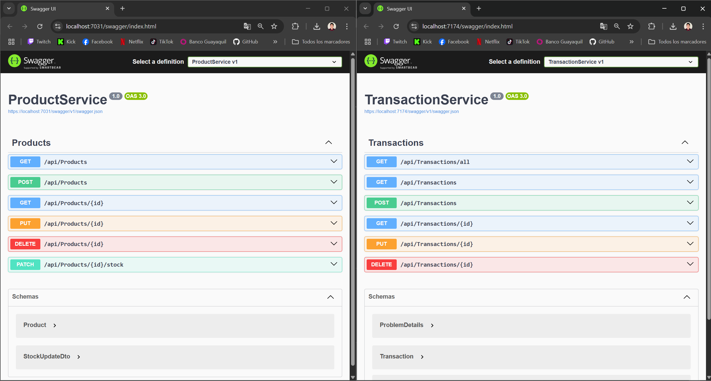

- ✅ Pruebas unitarias EndPoint  

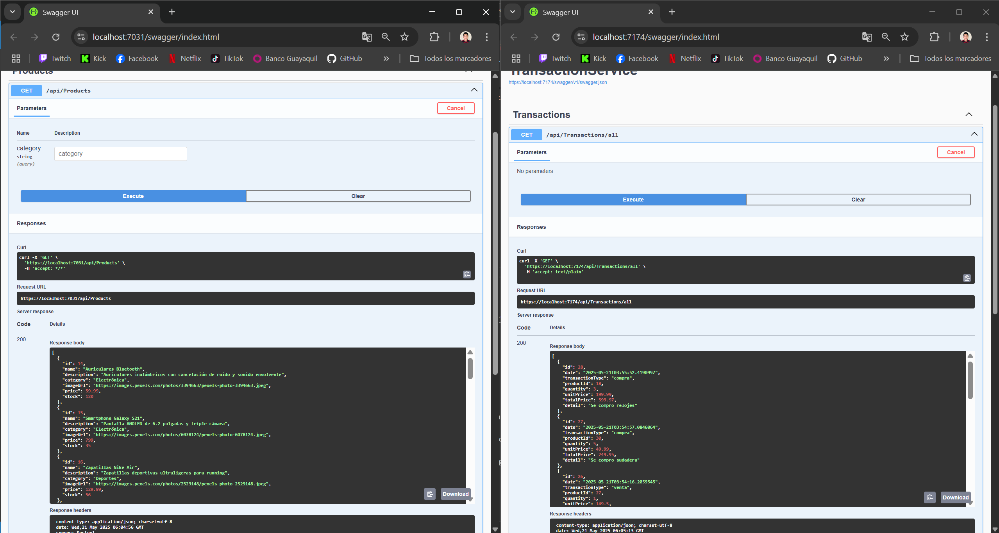

### Frontend:
- ✅ Console de producción sin errores  

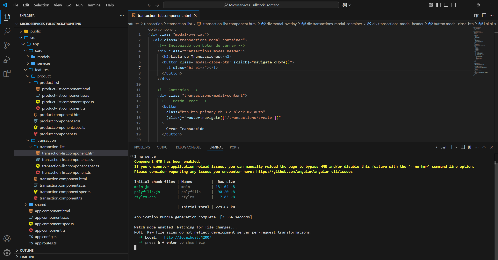

- ✅ Conexión con APIs verificada  

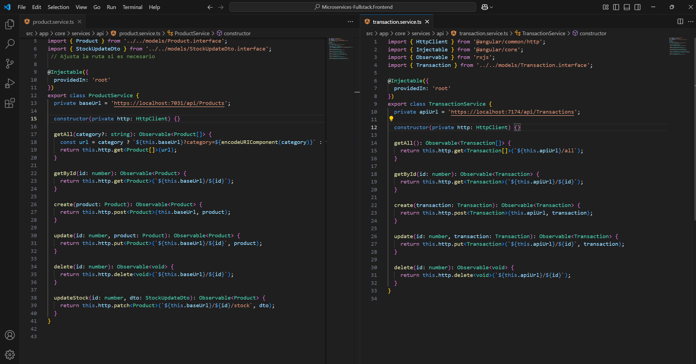


##  🧪 Evidencias
Agrega capturas de pantalla que demuestren la funcionalidad del sistema:

 ✅ Página principal

 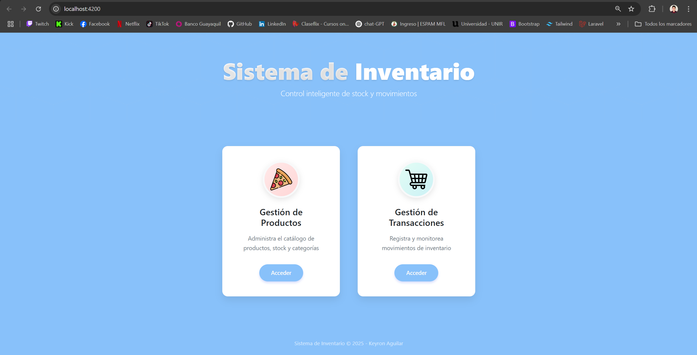

 ✅ Listado dinámico de productos con paginación

  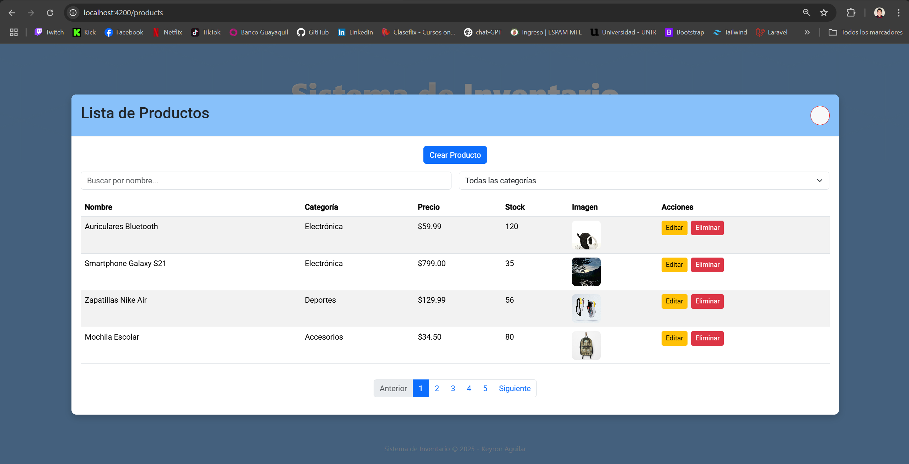

 ✅ Listado dinámico de transacciones con paginación

  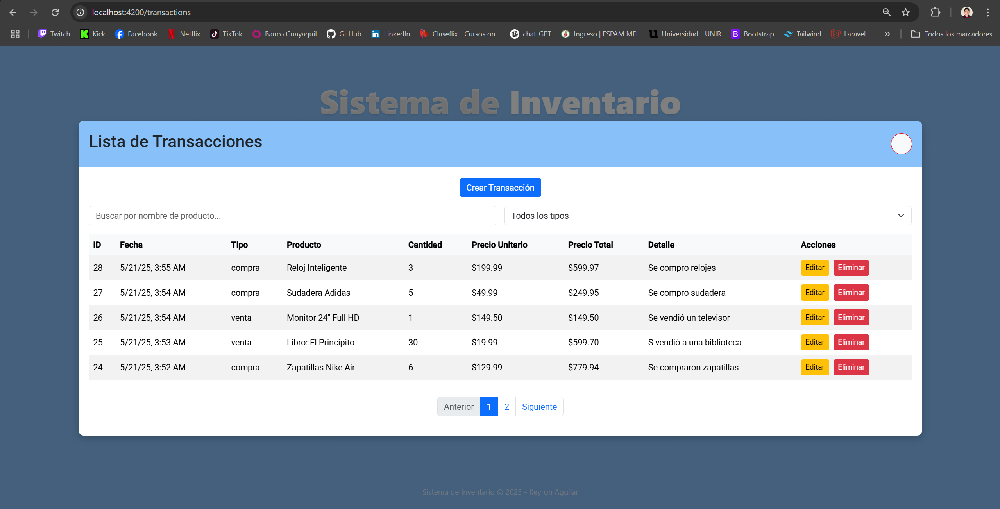

 ✅ Pantalla de creación de productos

  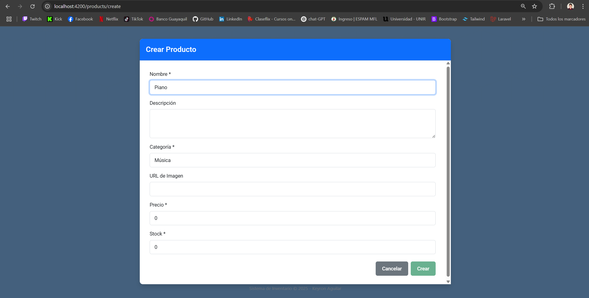

 ✅ Pantalla de edición de productos

   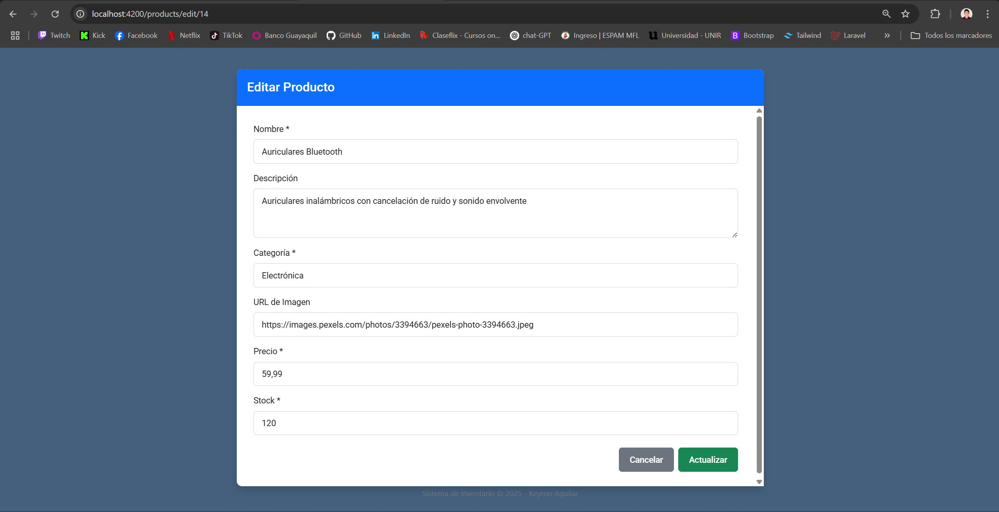

 ✅ Pantalla de creación de transacciones

   

 ✅ Pantalla de edición de transacciones

   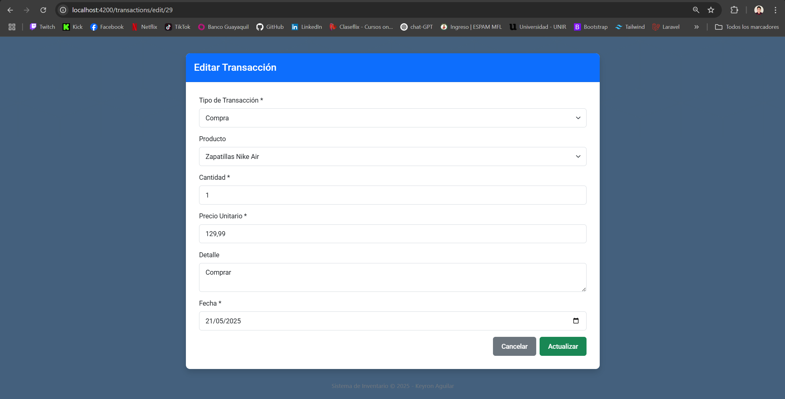

 ✅ Pantalla de filtros dinámicos

   - Tabla Producto

   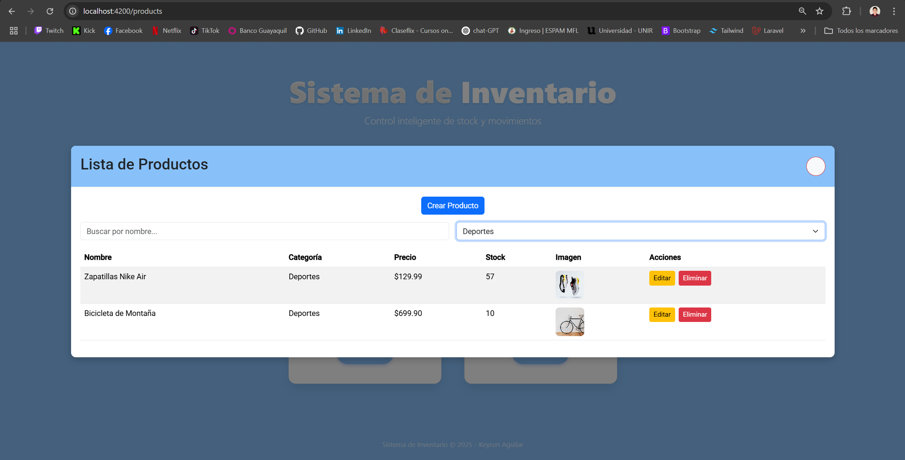

   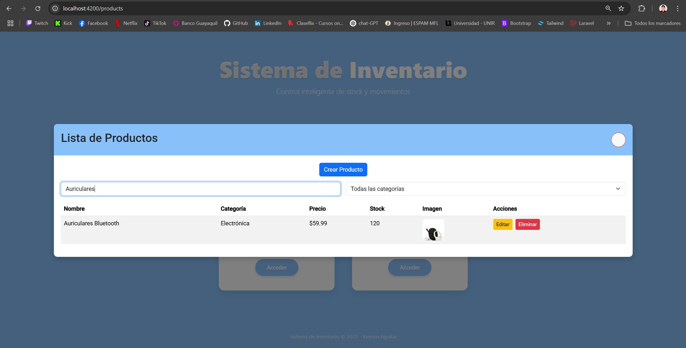

   - Tabla Transacción

   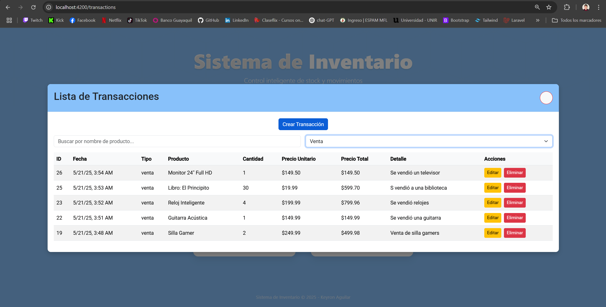

   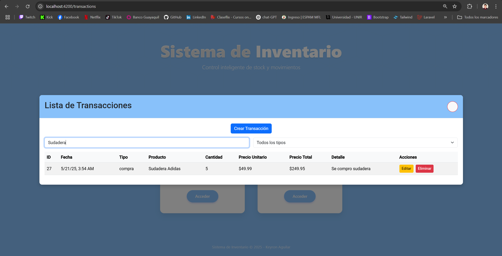


## 🚀 Despliegue

### SQL Server (Backend):
- Tabla Producto

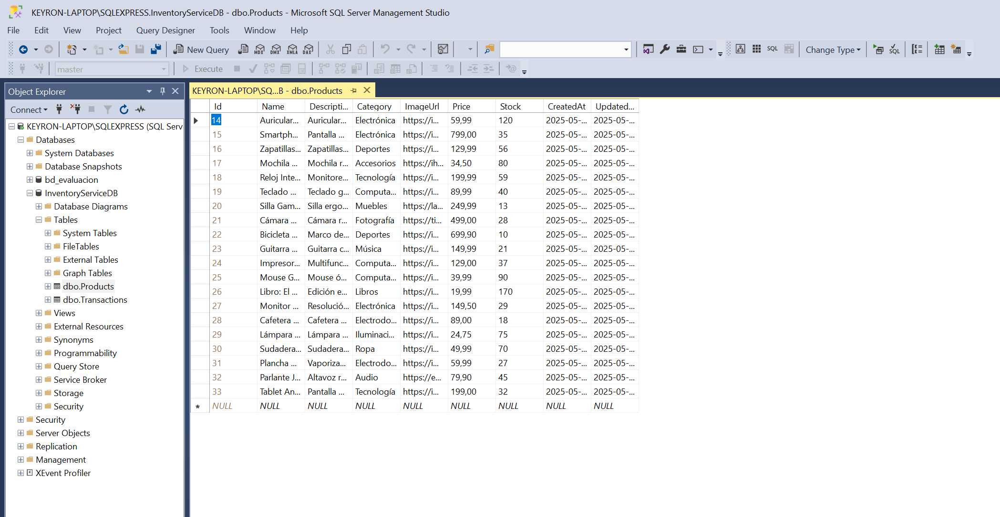

- Tabla Transacción

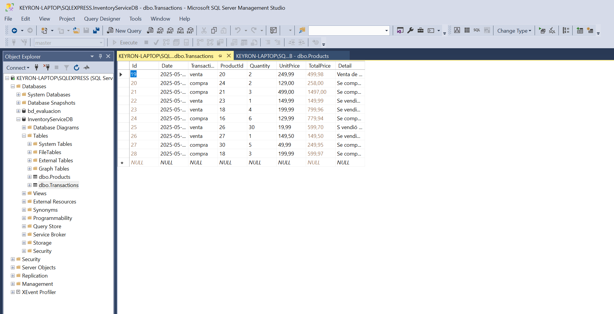


## 📌 Autor
Desarrollado como parte de una evaluación técnica full stack .NET + Angular por KEYRON AGUILAR.